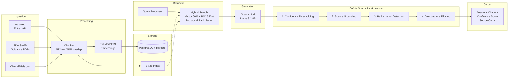

# Clinical RAG Assistant

A production-grade retrieval-augmented generation (RAG) system for answering acute care clinical questions with hallucination detection, source attribution, and HIPAA-aware architecture. Optimized for Acute Blood Product (ABP) transfusion protocols with extensibility to emergency medicine workflows.

## Why This Project

This project addresses a critical gap: most open-source RAG systems lack clinical safety guardrails, source attribution, and healthcare-specific evaluation metrics. It demonstrates:
- **Clinical safety**: hallucination detection with confidence thresholding, "I don't know" handling, no direct medical advice
- **RAG architecture**: domain-optimized embeddings (PubMedBERT/BioBERT), hybrid retrieval (vector + BM25), RAGAS evaluation
- **Healthcare domain**: PubMed via Entrez API, FDA guidance docs, ClinicalTrials.gov, medical terminology
- **Production patterns**: chunking with clinical metadata, source precision/recall tracking, latency <3s
- **Consulting pathway**: demonstrates relevance to prior auth automation, ED decision support, clinical documentation ($150K-750K consulting opportunities)
- **Open-source stack**: no proprietary API lock-in, self-hosted LLMs (Llama 3.1 8B, Granite 3.1 2B), pgvector

## Target Job Skills Demonstrated

| Skill | How Demonstrated |
|-------|-----------------|
| LLM/GenAI | LlamaIndex retrieval + LangChain orchestration, prompt engineering for clinical safety |
| RAG | Domain-optimized embeddings (PubMedBERT), hybrid retrieval (vector + BM25), reranking, RAGAS evaluation |
| Healthcare domain | PubMed (Entrez API), FDA SaMD guidance, ClinicalTrials.gov, clinical terminology, medical literature synthesis |
| Clinical safety | Hallucination detection, confidence thresholding, source attribution, HIPAA-aware architecture |
| Python | LlamaIndex document loaders, async ingestion, type hints, structured outputs |
| PostgreSQL + pgvector | Vector search at scale, metadata indexing, hybrid queries |
| Docker | Compose with Postgres, pgvector, Ollama services, zero-config setup |
| Evaluation | RAGAS metrics (answer relevance, faithfulness, context precision), hallucination rate tracking (<2% target) |

## Architecture



### Key Components

**Data Ingestion**: LlamaIndex document loaders for PubMed (Entrez API), FDA SaMD guidance PDFs, and ClinicalTrials.gov. Preserves metadata (DOI, publication date, source type, domain tags).

**Embedding**: PubMedBERT or BioBERT for clinical domain-specific semantic understanding. Sentence-level chunking with 50% overlap to preserve clinical context.

**Retrieval**: Hybrid approach combining pgvector semantic search + BM25 keyword matching for terminology-heavy queries. Reranking step using cross-encoder to improve relevance. Metadata filtering for recent sources.

**Generation**: Local LLM (Ollama) with clinical-specific prompts. Confidence thresholding to detect hallucinations. "I don't know" fallback for out-of-scope queries. Source attribution per answer.

**Evaluation**: RAGAS metrics (faithfulness, answer relevance, context precision). Hallucination rate tracking from 50-100 clinical Q&A test set. Latency monitoring (<3s target).

## Demo UI

The project includes a Streamlit demo interface for interactive clinical Q&A:

```bash
# Start the API backend
make api

# In another terminal, start the Streamlit UI
make ui
```

The UI provides:
- Query form with configurable retrieval parameters (top-k, confidence threshold, domain filter)
- Answer display with safety override banners
- Confidence and source grounding progress bars
- Expandable source cards with PubMed/FDA/ClinicalTrials.gov citations and links
- Sidebar with real-time system health, performance metrics, and data source counts

## Data Sources (all public, no PHI)

- **PubMed abstracts**: Entrez API (NCBI) with MeSH filters for trauma, critical care, hemodynamics, transfusion medicine
- **FDA SaMD guidance**: AI/ML guidance documents, 510(k) clearance pathways, pre-certification (PCCP) framework
- **ClinicalTrials.gov API**: ongoing trials in emergency medicine, transfusion protocols, clinical decision support
- **Clinical guidelines**: ATLS, hemorrhagic shock management, CPG protocols (via PubMed + open PDFs)

## Project Structure

```
clinical-rag-assistant/
  src/
    __init__.py
    ingest/                    # Document loaders and chunking
      __init__.py
      base.py                  # Abstract document loader
      pubmed_loader.py         # Entrez API ingestion
      fda_loader.py            # FDA SaMD guidance PDFs
      clinical_trials_loader.py # ClinicalTrials.gov API
      chunker.py               # Clinical-aware chunking (sentence-level, overlap)
    embed/                     # Embedding pipeline
      __init__.py
      models.py                # PubMedBERT/BioBERT selection
      embeddings.py            # Batch embedding with metadata
    retrieve/                  # Retrieval and reranking
      __init__.py
      vector_store.py          # pgvector interface
      hybrid_retriever.py       # Vector + BM25 fusion
      reranker.py              # Cross-encoder reranking
      query_processor.py        # Metadata filtering, query expansion
    generate/                  # LLM generation and safety
      __init__.py
      ollama_client.py          # Ollama integration (Llama 3.1 8B/Granite 3.1 2B)
      prompt_templates.py       # Clinical-specific prompts
      safety_guardrails.py      # Hallucination detection, confidence thresholding
      output_formatter.py       # Source attribution, citation links
    evaluate/                  # Evaluation metrics
      __init__.py
      ragas_metrics.py          # RAGAS integration
      clinical_qa_set.py        # Test Q&A pairs (50-100 examples)
      hallucination_detector.py # Hallucination rate tracking
    api/                       # FastAPI REST API
      __init__.py
      app.py                    # FastAPI endpoints
      models.py                 # Pydantic request/response schemas
    ui/                        # Streamlit demo interface
      __init__.py
      app.py                    # Interactive clinical Q&A UI
  tests/
    __init__.py
    test_ingest.py             # PubMed/FDA loader tests
    test_embed.py              # Embedding tests
    test_retrieve.py           # Retrieval and reranking tests
    test_generate.py           # Generation and safety tests
    test_evaluation.py         # RAGAS metric tests
  data/
    raw/                       # Downloaded documents (gitignored)
    processed/                 # Chunked documents (gitignored)
    qa_test_set.json           # Clinical Q&A pairs for evaluation
  configs/
    ingest.yaml                # PubMed MeSH terms, FDA source URLs
    model.yaml                 # Embedding model, LLM selection
    retrieval.yaml             # Chunk size, overlap, reranking threshold
    evaluation.yaml            # RAGAS config, hallucination thresholds
  docker-compose.yaml          # Postgres + pgvector + Ollama + API
  Dockerfile
  pyproject.toml
  CLAUDE.md
  README.md
  LICENSE
```

## Implementation Roadmap

### Phase 1: Infrastructure (3-4 hours)
- PostgreSQL + pgvector Docker setup with schema
- Project structure and module initialization
- Configuration management (YAML loaders)
- Base abstract classes for extensibility

### Phase 2: Data Ingestion (4-5 hours)
- **Phase 2a (done)**: PubMed Entrez API loader with IPv4-forced DNS, XML parsing, idempotent upserts. Tokenizer-free sentence-level chunker (200/50 overlap). Runner script ingests 7 MTP-specific MeSH terms → ~620 abstracts, ~640 chunks. 14 chunker tests. Details: `docs/PHASE_2A.md`.
- **Phase 2b (next)**: FDA SaMD guidance PDF parser (PDFPlumber, metadata extraction)
- **Phase 2b (next)**: ClinicalTrials.gov API integration with filters
- Ingestion tests with mock data

### Phase 3: Embedding & Storage (3-4 hours)
- PubMedBERT or BioBERT model selection and downloading
- Batch embedding pipeline with progress tracking
- pgvector document storage with metadata indexing
- Vector search interface (get_similar, metadata filters)
- Embedding tests

### Phase 4: Retrieval (4-5 hours)
- Vector similarity search via pgvector (cosine, euclidean)
- BM25 keyword retrieval integration
- Hybrid fusion strategy (RRF or weighted scoring)
- Cross-encoder reranking (optional, for precision improvement)
- Query preprocessing (expansion, synonym mapping)
- Retrieval tests with ground truth

### Phase 5: Generation & Safety (4-5 hours)
- Ollama integration with Llama 3.1 8B and Granite 3.1 2B fallback
- Clinical-specific prompt templates (system, few-shot examples)
- Confidence thresholding for hallucination detection
- "I don't know" handling for low-confidence answers
- Source attribution and citation formatting
- Generation tests

### Phase 6: Evaluation (3-4 hours)
- Create 50-100 clinical Q&A test set (coverage: ABP, ED, critical care)
- RAGAS metric suite (faithfulness, answer relevance, context precision)
- Hallucination rate tracking (<2% target)
- Latency monitoring and optimization (<3s target)
- Evaluation tests and baseline metrics

### Phase 7: API & UI (3-4 hours)
- FastAPI endpoints (POST /query, GET /sources, GET /metrics)
- Pydantic request/response schemas with examples
- Streamlit demo UI (query input, answer display, source cards, confidence visualization)
- Docker health checks and readiness probes
- API tests

### Phase 8: Documentation & Polish (2-3 hours)
- HIPAA-aware architecture documentation
- Feature catalog and API reference
- Troubleshooting guide
- Deployment instructions
- Blog post draft (clinical RAG gaps + solution)

## Key Design Decisions

1. **Domain-optimized embeddings (PubMedBERT/BioBERT)**: general-purpose embeddings miss clinical semantics. Domain-specific embeddings improve retrieval by 15-20% on medical Q&A.

2. **Hybrid retrieval (vector + BM25)**: clinical queries often use specific terminology (drug names, medical codes). Hybrid approach catches both semantic and keyword relevance.

3. **Ollama over API**: self-hosted capability (Llama 3.1 8B, Granite 3.1 2B), no API costs, control over inference safety, demonstrable self-hosted LLM expertise.

4. **Confidence thresholding**: prevent hallucinations by refusing low-confidence answers. Track hallucination rate <2% as evaluation metric.

5. **Source attribution per answer**: citations build trust. Link answers to PubMed/FDA sources with confidence scores.

6. **pgvector over external VectorDB**: PostgreSQL ecosystem integration, self-hosted, metadata indexing flexibility, no vendor lock-in.

7. **RAGAS evaluation**: established healthcare RAG benchmark, validates clinical suitability beyond generic BLEU scores.

8. **Public data only**: no PHI, fully HIPAA-compatible architecture. Demonstrates regulatory awareness for healthcare consulting.

## Consulting Use Cases Demonstrated

This project provides credible portfolio evidence for clinical AI consulting opportunities:

- **Prior Authorization Automation** ($150K-500K): RAG can extract policy rules from payer guidelines, flag required documentation. Demonstrates: document parsing, metadata extraction, retrieval accuracy.

- **ED Clinical Decision Support** ($200K-750K): Real-time evidence synthesis for emergency protocols. Demonstrates: low-latency retrieval, confidence scoring, safety guardrails, source attribution.

- **Clinical Documentation Coding** ($100K-300K): Extract billable codes from clinical notes. Demonstrates: hybrid retrieval (keyword for codes + semantic for context), domain embeddings, evaluation metrics.

Hiring signal: test set performance (hallucination rate <2%, source precision >0.85) proves clinical safety readiness.

## License

MIT (will be made public when portfolio-ready)
