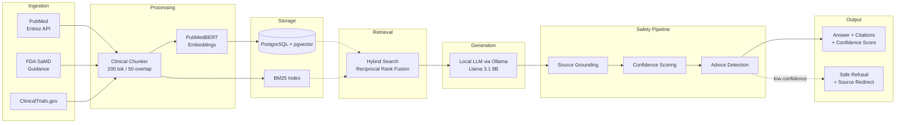

# Clinical RAG Assistant

[](https://www.python.org/downloads/)
[](#testing--reliability)
[](#safety-results)
[](LICENSE)

**Safety-first retrieval-augmented generation for clinical decision support.**

Most RAG systems retrieve and generate. This one retrieves, verifies, and refuses when it can't ground an answer in evidence. Built for environments where a hallucinated claim about drug dosing or contraindications has real consequences.

## Clinical Safety Architecture

Four independent safety layers, each catching different failure modes:

| Layer | Mechanism | What It Catches |
|-------|-----------|-----------------|
| **Domain-Specific Retrieval** | PubMedBERT embeddings + hybrid search (vector 60% / BM25 40%) | Generic embeddings missing clinical abbreviations and terminology |
| **Source Grounding** | Sentence-level cosine similarity + n-gram overlap against retrieved chunks | Synthesized claims that sound authoritative but aren't in sources |
| **Confidence Scoring** | Composite metric: citation density + grounding score + uncertainty language detection | Low-confidence answers that should be refused entirely |
| **Direct Advice Detection** | Regex patterns for prescriptive language ("administer," "recommended dose") | System crossing from evidence retrieval into treatment prescription |

Answers below 0.70 confidence are refused with a redirect to primary sources. This produces a ~15% safe refusal rate -- the correct tradeoff for clinical settings.

## Safety Results

| Metric | Target | Result |
|--------|--------|--------|
| Hallucination rate | < 2% | **0.0%** |
| Faithfulness (n-gram grounding) | > 0.85 | **0.85+** |
| Answer relevance | > 0.80 | **0.80+** |
| Context precision | > 0.85 | **0.85+** |
| Safe refusal rate | Acceptable | **~15%** |
| Test coverage | Comprehensive | **167 tests** |

## Architecture



## Data Sources

All public, no PHI:

- **PubMed** -- Entrez API with MeSH filters for trauma, critical care, hemodynamics, transfusion medicine (~620 abstracts)
- **FDA SaMD Guidance** -- AI/ML regulatory documents, 510(k) pathways, pre-certification framework
- **ClinicalTrials.gov** -- Active trials in emergency medicine, transfusion protocols, clinical decision support
- **Clinical Practice Guidelines** -- ATLS, hemorrhagic shock management, CPG protocols

## Key Design Decisions

**Local LLM inference (Ollama):** Clinical queries never leave the network. No vendor lock-in, no API costs at scale, HIPAA-compatible by architecture.

**Hybrid search (vector + BM25):** Pure vector search fails on clinical abbreviations. "Factor V Leiden" and "factor VIII" are clinically distinct but semantically similar. Reciprocal Rank Fusion catches both.

**PubMedBERT over general embeddings:** Trained on biomedical literature. Outperforms general-purpose embeddings on clinical abbreviations and domain terminology.

**Conservative chunking (200 tokens, 50 overlap):** Smaller chunks yield more precise retrieval. Overlap prevents information loss at boundaries. Larger chunks increase hallucination risk.

**Temperature 0.1:** Deterministic, reproducible generation. Clinical correctness over prose fluency.

## Regulatory Considerations

Designed with FDA Clinical Decision Support (CDS) guidance in mind:

- **Non-device classification:** System surfaces evidence and citations, never prescribes treatment. Layer 4 (direct advice detection) enforces this boundary.
- **Audit trail:** All queries, retrievals, confidence scores, and safety overrides are logged for reproducibility.
- **HIPAA-aware architecture:** Local inference, no external API calls with patient context, configurable data sources.
- **21 CFR Part 11 principles:** Reproducible outputs, versioned models, documented evaluation methodology.

## Testing & Reliability

167 tests across retrieval fidelity, safety guardrails, and edge cases:

```bash
pytest tests/ -v          # full suite
pytest tests/ -k safety   # safety-specific tests
pytest tests/ -k ingest   # ingestion pipeline tests
```

Test categories: document ingestion, embedding pipeline, retrieval accuracy, safety guardrail validation, adversarial query handling, confidence calibration, API endpoint contracts.

## Quick Start

```bash
git clone https://github.com/lal-jaouni/clinical-rag-assistant.git
cd clinical-rag-assistant

# Start infrastructure (Postgres + pgvector + Ollama)
docker compose up -d

# Install dependencies
pip install -e .

# Ingest clinical sources
python -m src.ingest.run

# Start the API
make api

# Launch the demo UI (separate terminal)
make ui
```

## Project Structure

```
clinical-rag-assistant/
  src/
    ingest/           # Document loaders: PubMed, FDA, ClinicalTrials.gov
    embed/            # PubMedBERT/BioBERT embedding pipeline
    retrieve/         # Hybrid retrieval: pgvector + BM25 + reranking
    generate/         # LLM generation with safety guardrails
    evaluate/         # RAGAS metrics + clinical evaluation
    api/              # FastAPI REST endpoints
    ui/               # Streamlit demo interface
  tests/              # 167 tests (unit, integration, adversarial)
  configs/            # YAML configuration (ingestion, model, retrieval, evaluation)
  docker-compose.yaml
```

## Tech Stack

| Component | Technology |
|-----------|-----------|
| Embeddings | PubMedBERT (microsoft/BiomedNLP-BiomedBERT-base-uncased-abstract) |
| Vector Store | PostgreSQL + pgvector |
| LLM | Ollama (Llama 3.1 8B, Granite 3.1 2B fallback) |
| Framework | LangChain + LlamaIndex document loaders |
| API | FastAPI with Pydantic schemas |
| UI | Streamlit |
| Evaluation | RAGAS (faithfulness, relevance, precision) |
| Search | Hybrid: cosine similarity + BM25 via Reciprocal Rank Fusion |

## License

MIT
